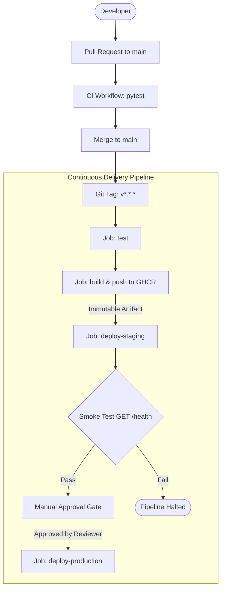

# MLOps Continuous Delivery (CD) for ML Application

[](https://github.com/thelilghaza/i220932_B_CA1/actions/workflows/ci.yml)
[](https://github.com/thelilghaza/i220932_B_CA1/actions/workflows/cd.yml)

This repository implements an automated, production-grade Continuous Delivery (CD) pipeline for a Machine Learning inference microservice using **Flask**, **Docker**, **GitHub Container Registry (GHCR)**, **GitHub Actions**, **Staging Environments**, **Automated Smoke Testing**, and **Manual Production Approval Gates**.

---

## Architecture & CD Pipeline Flow



---

## Key Principles Implemented

1. **Continuous Delivery vs Continuous Deployment**: Staging deployment and smoke testing are automated. Production deployment requires explicit manual human approval via GitHub Environment protection rules.
2. **Build Once, Deploy Many (Immutable Artifacts)**: The Docker container image is built once during the release phase, tagged with the semantic version (e.g. `1.0.0`), and stored in GHCR. The exact same immutable image verified in staging is promoted to production.
3. **Production Traceability (Section 30 & Bonus)**: The `/health` endpoint exposes `application_version`, `model_version`, `git_commit` hash, and operational `status`.
4. **Fast, Safe Rollback (Section 25)**: When a bad version is deployed, rollback is achieved in seconds by redeploying the previous immutable image tag without rebuilding code.

---

## API Specification

### `GET /`
Returns service status.
```json
{
  "service": "mlops-demo",
  "status": "running"
}
```

### `GET /health`
Returns health status, application version, model version, and Git commit hash.
```json
{
  "application_version": "1.0.0",
  "model_version": "1.0",
  "git_commit": "7a3b4c1",
  "status": "healthy"
}
```

### `POST /predict`
Performs ML inference.
- **Request Body**: `{"value": 5}`
- **Response**:
```json
{
  "input": 5.0,
  "prediction": 10.0,
  "model_version": "1.0"
}
```

---

## Local Verification & Dedicated Course Container

### Dedicated Container
A dedicated container `mlops-api-course` runs on port `5000`:
```bash
docker compose up -d mlops-api
```

Test endpoints:
```bash
# Health check
curl http://localhost:5000/health

# Prediction
curl -X POST http://localhost:5000/predict \
  -H "Content-Type: application/json" \
  -d '{"value": 5}'
```

### End-to-End Pipeline & Rollback Simulation
To simulate the complete CD lifecycle (CI tests $\rightarrow$ build artifact $\rightarrow$ staging deployment $\rightarrow$ smoke test $\rightarrow$ approval gate $\rightarrow$ production promotion $\rightarrow$ v1.1.0 release $\rightarrow$ instant rollback):
```bash
bash scripts/simulate_pipeline.sh
```

---

## User-End Steps for GitHub & Cloud Deployment

### Step 1: Create GitHub Repository
Create a new repository under your GitHub account:
```
Repository name: i220932_B_CA1 (or mlops-cd-demo)
Visibility: Public or Private
```

### Step 2: Configure SSH Authentication
An ED25519 SSH key has been generated locally at `~/.ssh/id_ed25519.pub`.
1. Copy the public key:
   ```bash
   cat ~/.ssh/id_ed25519.pub
   ```
2. In GitHub, go to **Settings** $\rightarrow$ **SSH and GPG keys** $\rightarrow$ **New SSH key**.
3. Paste the key and save.

### Step 3: Configure GHCR Workflow Permissions
In your GitHub repository:
- Go to **Settings** $\rightarrow$ **Actions** $\rightarrow$ **General**.
- Scroll to **Workflow permissions**.
- Select **Read and write permissions**.
- Click **Save**.

### Step 4: Configure GitHub Environments & Approval Gate
In your GitHub repository:
- Go to **Settings** $\rightarrow$ **Environments**.
1. Click **New environment** $\rightarrow$ name it `staging`.
   - Add Secrets:
     - `STAGING_HOST`: Target server IP or hostname.
     - `STAGING_USER`: Remote username (e.g. `ubuntu`).
     - `STAGING_SSH_KEY`: Content of the deployment private key (`cat deploy_key`).
2. Click **New environment** $\rightarrow$ name it `production`.
   - Check **Required reviewers** and add your GitHub username.
   - Add Secrets:
     - `PRODUCTION_HOST`: Production server IP or hostname.
     - `PRODUCTION_USER`: Production username.
     - `PRODUCTION_SSH_KEY`: Content of the deployment private key (`cat deploy_key`).

### Step 5: Triggering CD Releases
To trigger a new release delivery:
```bash
git tag v1.0.0
git push origin v1.0.0
```
Then navigate to **GitHub Actions** tab to observe staging deployment, automated smoke tests, and the manual approval prompt for production!
